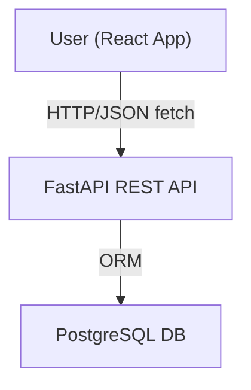

# Tic Tac Toe Frontend (React)

## Project Purpose

This is the web frontend for Tic Tac Toe Pro, providing a streamlined user interface for registration, login, playing Tic Tac Toe (single or multiplayer), and tracking your performance via leaderboards and history. The app connects to a FastAPI backend and demonstrates modern, minimal design and real-time feedback.

## Prerequisites

- Node.js (v18+ recommended)
- npm (v9+ recommended)

## Setup Instructions

1. **Navigate to the frontend directory**:
   ```bash
   cd tic_tac_toe_frontend
   ```

2. **Install dependencies**:
   ```bash
   npm install
   ```

3. **(Optional) Configure environment**:

   To connect to a deployed backend or custom API URL, set an environment variable:

   - `REACT_APP_BACKEND_URL` (default: `http://localhost:8000`)

   For example, create a `.env` file:
   ```
   REACT_APP_BACKEND_URL=http://your-backend-server:8000
   ```

## Running and Development

- Start development server:
  ```bash
  npm start
  ```
  The app runs at [http://localhost:3000](http://localhost:3000).

- Run tests:
  ```bash
  npm test
  ```

- Build for production:
  ```bash
  npm run build
  ```

## Environment Variable Usage

| Variable                 | Description                                | Default                  |
|--------------------------|--------------------------------------------|--------------------------|
| REACT_APP_BACKEND_URL    | URL of the backend FastAPI server          | http://localhost:8000    |

- If not set, all requests default to local backend.

## API Summary (Integration)

The app communicates with backend endpoints as follows:

| Endpoint                  | Method | Description                    | Example use              |
|---------------------------|--------|--------------------------------|--------------------------|
| `/api/auth/register`      | POST   | Register account               | { username, password }   |
| `/api/auth/login`         | POST   | Login, returns JWT             | username/password form   |
| `/api/game/new`           | POST   | Create/join game               | { type: "single"/"multi" } |
| `/api/game/{id}/move`     | POST   | Play move                      | { x: int, y: int }       |
| `/api/leaderboard`        | GET    | View leaderboard               |                          |
| `/api/history`            | GET    | View game history (user)       |                          |

Authentication (JWT) is securely stored in browser storage. Requests automatically attach the auth token when calling protected endpoints.

## Architecture



- The app uses React Router for navigation (`/login`, `/register`, `/lobby`, `/leaderboard`, `/history`).
- State management is internally handled via React hooks.
- Backend API endpoint is configurable via environment.

## Example User/Game Flow

1. **First Visit**: User is prompted to log in or register.
2. **Register/Login**: Submits credentials to backend; receives and stores JWT.
3. **Lobby**: User can start a new game (single or multi) or join an open multiplayer match.
4. **Gameplay**: Interface displays current board, whose turn, and interacts with `/api/game/{id}/move`.
5. **Results**: On game end, user can review stats/history or access the leaderboard.

## Feature Highlights

- Modern, minimal UI (custom CSS, responsive)
- JWT authentication (secure)
- Persistent score/leaderboard/history
- Single and multiplayer modes
- Fully decoupled from backend for flexible deployment

---

Task completed: README files for both backend and frontend created, including API usage, architecture, setup, and all required documentation.
